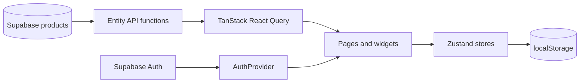

<div align="center">
  
  <h1>PIZZARO</h1>
  <p>A responsive restaurant catalog and food-delivery demo built with React, TypeScript, Supabase, and Feature-Sliced Design.</p>
  <p>
    
    
    
    
    
  </p>
</div>

## About the project

PIZZARO is a client-side SPA for browsing a restaurant menu and completing a demonstration delivery order. Products are loaded from Supabase, server state is cached with TanStack React Query, and cart and favorite data are persisted locally with Zustand.

The current release is a **demo MVP** intended for learning and portfolio presentation. Checkout validates the delivery form and completes a simulated order, but it does not create a server-side order or process a real payment.

## Features

- Browse pizza, sushi, burgers, and drinks loaded from Supabase.
- Filter products by category and search by title with a 500 ms debounce.
- Sort the catalog by default order, rating, or base price.
- Open a dedicated product page with loading, error, and not-found states.
- Add a selected quantity to the cart and receive an animated toast notification.
- Change quantities, remove items, clear the cart, and keep it after a refresh.
- Sign up, sign in, sign out, and restore a Supabase Auth session.
- Keep separate persisted favorite lists for authenticated users.
- Complete a validated demo checkout and view a guarded success page.
- Use responsive desktop and mobile navigation, sidebars, and layouts.
- Load routes and heavier home-page sections lazily.

## Tech stack

| Area | Technology |
| --- | --- |
| UI | React 19, TypeScript 6, Tailwind CSS 4 |
| Build | Vite 8, React Compiler, Rolldown Babel plugin |
| Routing | React Router 7 with lazy-loaded routes |
| Backend service | Supabase database and email/password authentication |
| Server state | TanStack React Query |
| Client state | Zustand with `persist` middleware |
| UI libraries | Embla Carousel, Lucide React |
| Deployment | Vercel SPA rewrite configuration |
| Quality checks | ESLint, TypeScript project build, Vite production build |

## Architecture

The source code follows Feature-Sliced Design principles. Modules expose their public API through `index.ts` files, and imports inside `src` use the `@` alias.

```text
src/
├── app/       # application shell, providers, router, and main layout
├── pages/     # route-level pages
├── widgets/   # large reusable page sections
├── features/  # user actions: auth, cart, and favorites
├── entities/  # product and category models, API, hooks, and UI
├── shared/    # Supabase client, hooks, constants, and base UI
└── assets/    # images, logo, and SVG icons
```

### Data and state flow



- Product data is treated as server state and cached by category, search value, and sort option.
- Cart and favorite data are client state. Only the persisted slices are written to `localStorage`.
- Favorites are keyed by the authenticated Supabase user ID.
- `AuthProvider` exposes session loading, authenticated, and anonymous states to the UI.

## Routes

| Route | Purpose |
| --- | --- |
| `/` | Home page with hero, categories, popular dishes, and an about section |
| `/menu/all` | Full product catalog |
| `/menu/:categorySlug` | Category-filtered catalog |
| `/menu/:categorySlug/:productSlug` | Product details |
| `/auth/sign-in` | Email/password sign-in |
| `/auth/sign-up` | Account registration |
| `/about` | Restaurant story |
| `/contacts` | Contact information and newsletter UI |
| `/checkout` | Cart summary and demo delivery form |
| `/checkout/success` | Guarded demo order confirmation |

`/menu` redirects to `/menu/all`, `/auth` redirects to `/auth/sign-in`, and unknown paths render the not-found page.

## Getting started

### Prerequisites

- Node.js `^20.19.0` or `>=22.12.0`
- npm
- A Supabase project with email/password authentication enabled
- A `products` table and a safe RLS policy that allows the anonymous client to read active catalog items

### Installation

```bash
git clone https://github.com/Alex-20031003/PIZZARO.git
cd PIZZARO
npm ci
```

Create a local `.env` file in the project root:

```env
VITE_SUPABASE_URL=your_supabase_project_url
VITE_SUPABASE_ANON_KEY=your_supabase_anon_key
```

Only use the browser-safe Supabase anon key here. Never expose a service-role key in a Vite environment variable. Public catalog access must be protected by an appropriate Row Level Security policy.

Start the development server:

```bash
npm run dev
```

Vite prints the local and network URLs after startup. The default local address is typically `http://localhost:5173`.

### Expected product data

The application expects the Supabase `products` table to provide these fields:

```text
id, category, title, slug, description, ingredients, tags,
image_url, base_price, discount_price, is_available, is_active,
rating, sort_order, config, created_at, updated_at
```

Catalog category values currently used by the UI are `pizza`, `sushi`, `burger`, and `drink`. The `all` category is handled only by the client and is not stored as a product category.

## Available scripts

| Command | Description |
| --- | --- |
| `npm run dev` | Start Vite in development mode and expose it to the local network |
| `npm run lint` | Run ESLint across the project |
| `npm run build` | Run the TypeScript project build and create a production bundle |
| `npm run preview` | Preview the production bundle locally |

## Deployment

The included `vercel.json` rewrites all requests to `index.html`, allowing React Router routes to work when opened directly on Vercel.

For deployment, configure `VITE_SUPABASE_URL` and `VITE_SUPABASE_ANON_KEY` in the hosting provider. Do not commit `.env` files or secret keys.

## Engineering decisions

- **Server and client state are separated.** React Query owns remote catalog data, while Zustand owns local interactions.
- **Query keys describe the visible catalog.** Category, debounced search text, and sorting are included so each result can be cached independently.
- **Favorites are user-scoped.** Signing out hides the current list without mixing it with another account's data.
- **Checkout is explicitly a demo.** The application does not request card data or pretend that a client-only action is a real payment.
- **Unavailable products are filtered at the data boundary.** Inactive or unavailable records are excluded from catalog and product queries.
- **Lazy loading preserves the application shell.** Header and footer remain visible while route chunks use a shared loading fallback.

## Current limitations

- Checkout is client-side only: no order is stored and no payment is processed.
- Registration does not yet show a dedicated pending state when Supabase email confirmation is enabled.
- Google OAuth, editable profiles, order history, and product administration are not implemented.
- The newsletter form and some contact or social links are demo-only.
- Supabase types are currently maintained manually and API responses do not have runtime schema validation.
- Automated tests and a global Error Boundary have not been added yet.
- Some keyboard and screen-reader accessibility improvements remain in the roadmap.

## Roadmap

- [ ] Handle the email-confirmation registration state.
- [ ] Complete the accessibility pass for navigation, sidebars, forms, and carousels.
- [ ] Add a global Error Boundary and validate required environment variables.
- [ ] Generate Supabase database types and validate external product data.
- [ ] Add store, component, and route-level tests.
- [ ] Add per-route metadata and replace demonstrational contact data.
- [ ] Introduce `profiles`, `orders`, and `order_items` with secure RLS policies.
- [ ] Add server-side price calculation, Stripe Checkout, and a signed webhook.
- [ ] Add authenticated order history and a role-protected product admin area.

## Project status

The main catalog-to-demo-checkout flow is complete and the project passes the configured lint and production build checks. The production commerce features listed above are intentionally tracked as future work rather than represented as completed functionality.

Built as a learning and portfolio project by [Alex](https://github.com/Alex-20031003).
